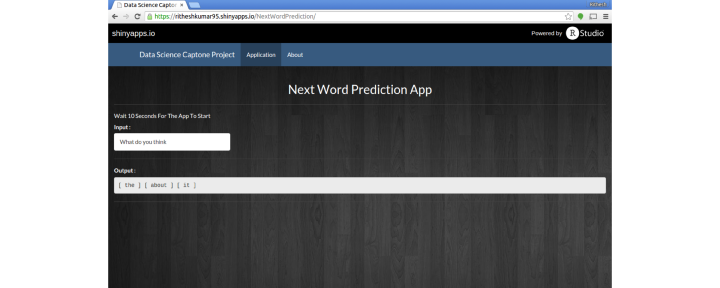

Swiftkey Data Science Capstone Project
========================================================
author: Rithesh Kumar
date: Sat Apr 18 13:56:56 2015
transition: concave

Introduction
========================================================
<small>
- The goal of this project is to allow a user to input a phrase into the application, and it would predict the next word that they “most likely” want to type.

- The primary use case for this application is text messaging on mobile phones.

- The data available for training the predictive model is millions of tweets, blog posts, and news articles in English

- Milestone Report Link : [Milestone Report](http://rpubs.com/ritheshkumar95/69066)

- Application link : [Shiny App - Next Word Prediction](https://ritheshkumar95.shinyapps.io/NextWordPrediction)

- Github Link : [Codes]()

</small>

Text Prediction Algorithm
========================================================
<small>

1. Preprocessing the text (e.g. filter non-English words, symbols)
2. Tokenization
3. Prepare unigram, bigram and trigram from the data
4. Count the occurrences of each unique unigram, bigram, trigram and quadgram
5. Calculate probabilties for each N-Gram using **Maximum Likelihood Estimate** And **Simlple Linear Interpolation**
6. Get the text phrase from the user
7. Extract the last three tokens (e.g. prev1, prev2) from the phrase. If the phrase is not long enough, extract the last two tokens or last token.
8. Return the top 3 matches with high proabability.
</small>

Shiny App - Next Word Prediction
========================================================
- Screenshot Of The App
 
- Instructions
     - Wait 10 seconds for the app to load
     - Enter text in input textbox
     - Top 3 most probable next words are displayed in the output textbox
</small></small>

Conclusion
========================================================
<small>
**Limitations**
 - RAM built-in to the laptop wasn't enough to handle the sheer size of the data
 - A sample representative population of ~1% was only used to train the model
 - Sparse values were removed during term document creation
 - The prediction model is biased towards train data. New word prediction is not very accurate

**References**
- [NLP Coursera Notes](http://files.asimihsan.com/courses/nlp-coursera-2013/notes/nlp.html#linear-interpolation-part-1)
- [Text Mining Infrastructure in R](http://www.jstatsoft.org/v25/i05/paper)
- [RWeka Package](http://cran.r-project.org/web/packages/RWeka/index.html)
